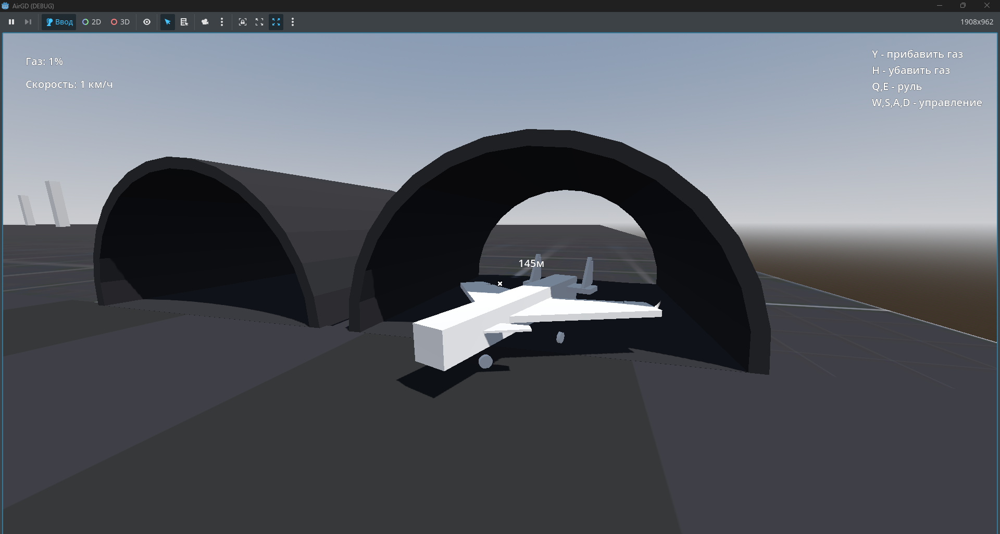
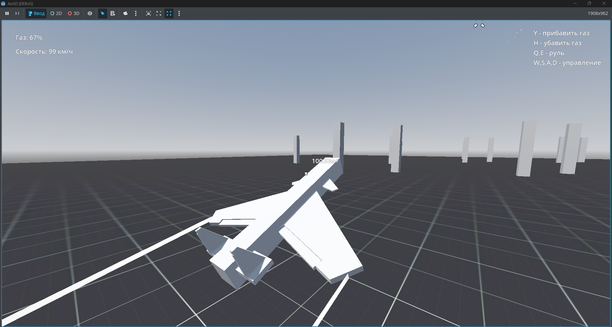
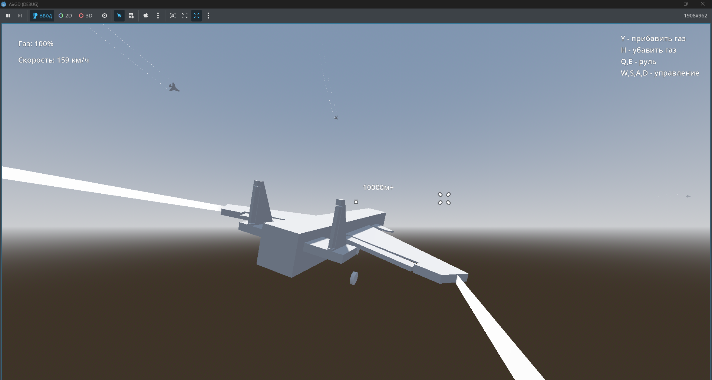

# AircraftGD - Godot 4 Aircraft Controller

**Реалистичный симулятор самолета с ИИ — готовая сцена, исходный код, аэродинамика, управление**

## О проекте

Этот репозиторий содержит готовую к использованию сцену с полностью настроенным контроллером самолета, построенным на основе `VehicleBody3D` в Godot Engine 4. Включает в себя физику полета, систему аэродинамики, управление закрылками, шаблонную 3D-модель самолета и простой ИИ для противников.

## Можно использовать!

Готовая сцена, 3D-модель, программный код, система аэродинамики — всё предоставляется свободно для любых целей:
*   Изучайте механику полета в Godot
*   Дорабатывайте и улучшайте
*   Встраивайте в свои проекты (аркады, симуляторы, гонки)
*   Используйте как основу для собственных воздушных транспортных средств

Единственная просьба: **указывайте меня как автора** (PRAVDA_SEMPAI).

## ✨ Особенности

*   **Готовая сцена:** Всё уже настроено и готово к запуску
*   **Шаблонная модель:** Включает 3D-модель самолета с анимированными закрылками
*   **Реалистичная аэродинамика:** Расчет подъемной силы, лобового сопротивления и сваливания
*   **Детальное управление:** Независимая настройка чувствительности по крену, тангажу и рысканию
*   **Динамический звук двигателя:** Громкость и тон меняются в зависимости от мощности
*   **Простая система AI:** Преследование цели и следование по точкам пути

## 🕹️ Управление

*   **Y / H** — Увеличить / Уменьшить мощность двигателя (Тяга)
*   **W / S** — Тангаж (Нос вниз / Нос вверх)
*   **A / D** — Крен (Наклон влево / вправо)
*   **Q / E** — Рыскание (Поворот влево / вправо) / Торможение на земле

## 🎮 Быстрый старт

1.  Скачайте проект
2.  Откройте папку в Godot Engine 4.2+
3.  Запустите главную сцену
4.  Управляйте самолетом с помощью клавиатуры!

## 📸 Скриншоты

## 📱 Соцсети

Следите за обновлениями и другими проектами:

[[YouTube](https://www.youtube.com/@pravda_sempai)
[[Rutube](https://rutube.ru/channel/41737058/)
[[VK](https://vk.com/pravdasempai)
[[Telegram](https://t.me/PRAVDASEMPAI)

## Лицензия

**Свободное использование с указанием авторства.**
Можете использовать сцену, модель и код для некоммерческих и коммерческих проектов, при условии указания автора **PRAVDA_SEMPAI**.

---

**Автор: PRAVDA_SEMPAI**
